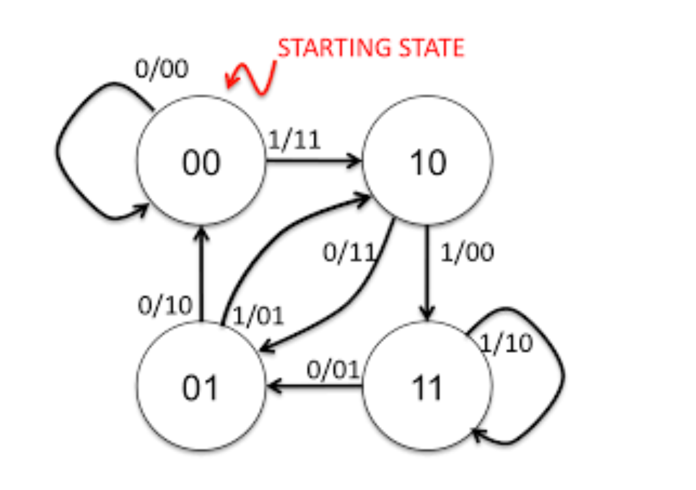

# Channel and Source Coding

In this repository I implemented a simple version of both channel and source coding.

## Content

`source_coding.py`: For source coding, I implemented **huffman tree** as source coder and decoder. In this file I implemented this algorithm using a min-heap and for decoding we use dfs. 

`channel_coding.py`: In this part, channel coding implemented by a **convolutional encoder**, using below state machine. 



`utils.py`: This file contain some utils like frequencies of words or a noise function for testing. 

## How to Run?
A simple `main.py` wroted for testing these coding/decodings. It gets an string and after source coding and then channel coding, apply some noise on it. Then it tries to decode them with channel and source coding, respectively.

```
python main.py <InputString>
```